# Ecosistema Moderno de Datos

## 1. Introducción

### SQL

**Qué es SQL?**

Por sus siglas en inglés "Structured Query Languaje" o "Lenguaje de
Consulta Estructurada", es un lenguaje de computación estandarizado que
se utiliza principalemente para almacenar, manipular y recuperar
información en bases de datos relacionales.

SQL se ha transformado en un estandar, cuando uno menciona Bases de
Datos, lo primero que se nos viene a la mente es SQL.

Las bases de datos existian antes que SQL.

**Como se guardaban los datos en las Bases**

-   Se guardaban o se guardan en ficheros.

-   Un fichero es un archivo de datos plano que almacena información sin
    relaciones complejas.

-   Los datos se guardan en una única tabla donde cada línea representa
    un registro, separados por delimitadores como comas y tabulaciones u
    otros caracteres especiales.

-   Que tipo de dato conocido son ficheros: "CSV, TXT o JSON"

**Problema**

-   Al no existir relaciones avanzadas, se suele repetir la misma
    información en varias filas.

-   No son eficientes para realizar consultas complejas o cruces de
    datos masivos.

-   Carecen de controles avanzados de permisos y transacciones propios
    de los sistemas relacionales.

Pero ustedes se preguntarán...

*"Pero si hablamos de archivos csv mencionas que hay escalabilidad
limitada y estos no son eficientes para realizar consultas complejas o
cruces de datos masivos. Pero digamos yo tengo dos csv que son enormes
en tamaño "GB" lo proceso en excel, lo transformo y si puedo consultar
hacer tablas y digamos tengo 2 csv y luego los transformo en Excel y
luego los cruzo con otro csv ó los proceso en R o en Python; donde esta
el problema o por qué la necesidad de SQL"*

El problema y la necesidad de SQL (y de los Sistemas de Gestión de Bases
de Datos Relacionales - RDBMS) no está en lo que puedes hacer tú solo en
tu computadora para un análisis puntual, sino en el rendimiento
operativo, la concurrencia y la integridad de los datos en entornos
reales.

**1. Concurrencia (Muchos usuarios a la vez)**

-   **El problema del CSV:** Un archivo CSV es un documento físico en un
    disco. Si un sistema web o una aplicación necesita escribir un nuevo
    dato mientras tú lo tienes abierto en Excel o lo estás
    sobrescribiendo con Python, el archivo se bloquea o uno de los dos
    sobrescribe el trabajo del otro.

-   **La solución de SQL:** Las bases de datos están diseñadas para que
    miles de usuarios echan, borren y consulten datos al mismo tiempo
    exactamente en la misma tabla sin bloquearse, gracias a un sistema
    de filas y transacciones.

**2. Memoria RAM vs. Almacenamiento en Disco**

-   **El problema del CSV:** Herramientas como Pandas (Python), R o
    Excel cargan los datos directamente en la memoria RAM para poder
    procesarlos rápido. Si tienes dos archivos CSV que juntos pesan 40
    GB y tu computadora tiene 16 GB de RAM, tu código se va a colgar
    (daría un error de Out of Memory).

-   **La solución de SQL:** SQL no carga toda la base de datos en la
    RAM. Los datos viven en el disco duro y el motor de la base de datos
    es extremadamente inteligente: solo va al disco, busca los pedacitos
    de datos que le pediste, los procesa y te devuelve el resultado,
    consumiendo un mínimo de RAM.

**3. Velocidad extrema mediante Índices (Indexación)**

-   **El problema del CSV:** Si buscas el cliente con el ID `948201` en
    un CSV de 50 millones de filas, Python o Excel tienen que leer el
    archivo línea por línea desde la número 1 hasta encontrarlo (o
    recorrer todo el set en memoria).

-   **La solución de SQL:** Puedes crear un Índice en la columna ID. Es
    como el índice de un libro físico: SQL sabe exactamente en qué
    página y línea del disco está ese cliente y lo encuentra en
    milisegundos, sin importar si la tabla tiene miles de millones de
    filas.

**4. Integridad y Reglas de Datos (Constraint)**

-   **El problema del CSV:** Un CSV aguanta lo que le pongas. Alguien
    puede abrir el CSV y escribir texto en una columna de fechas, o
    dejar vacío un campo obligatorio. Te das cuenta del error horas
    después cuando tu código de Python falla al procesarlo.

-   **La solución de SQL:** El motor de la base de datos actúa como un
    guardia. Si defines que una columna es de tipo `FECHA` y no puede
    ser vacía, el sistema rechaza de inmediato cualquier intento de
    insertar un dato corrupto, garantizando que los datos siempre estén
    limpios.

**5. Automatización y Ecosistema Vivo**

-   Un archivo CSV es una "foto" estática del pasado. Las bases de datos
    SQL son sistemas vivos que reciben transacciones de aplicaciones en
    tiempo real (por ejemplo, las compras que hacen los clientes en una
    página web en este mismísimo segundo). Hacer que Python abra,
    modifique y guarde un CSV cada vez que alguien hace un clic en una
    web sería inviable y peligrosamente lento.

| **Característica** | **Archivos CSV + Python/Excel** | **Base de datos SQL** |
|----|----|----|
| **Ideal para...** | Análisis de datos, reportes específicos, Ciencia de Datos | Aplicaciones web, sistemas de inventario, registrar transacciones |
| **Volumen de datos** | Limitado por la memoria RAM | Prácticamente ilimitado (Terabytes en disco) |
| **Acceso** | Un solo usuario o proceso a la vez | Miles de usuarios simultáneos |
| **Modificación** | Hay que reescribir el archivo completo |  |

**Bases de Datos relacionales**

Ya no hablamos de ficheros, entramos a un concepto mas amplio: ... "Las
tablas".

Entonces que es exactamente...

Es un sistema que organiza los datos en tablas estructuradas (filas y
columnas) que se conectan entre sí mediante elementos comunes. Es el
modelo más utilizado en el mundo del software para garantizar que la
información sea exacta, segura y esté perfectamente organizada.

El lenguaje estándar que se utiliza para hablar, consultar y administrar
estas bases de datos es el SQL (Structured Query Language).

**¿Cómo funciona la "Relación"?**

En lugar de meter toda la información en un solo archivo gigante (como
harías en un Excel o un CSV), una base de datos relacional separa los
datos en tablas lógicas y luego las une mediante **Llaves (Keys)**.

Imagina un sistema de una tienda:

-   **Tabla `Clientes`:** Tiene columnas como `ID_Cliente`, `Nombre` y
    `Correo`.

-   **Tabla `Pedidos`:** Tiene columnas como `ID_Pedido`, `Fecha` y
    `ID_Cliente`.

**La relación:** La columna `ID_Cliente` en la tabla de Pedidos apunta
directamente al cliente real en la tabla de Clientes. Así, no tienes que
repetir el nombre y el correo del cliente en cada compra; solo guardas
su número de ID.

**Componentes Clave**

-   **Tablas (Entidades):** Estructuras similares a hojas de cálculo con
    filas y columnas.

-   **Filas (Registros / Tuplas):** Cada fila representa un elemento
    único (un cliente específico, un producto concreto).

-   **Columnas (Campos / Atributos):** Definen el tipo de dato que se va
    a guardar (Texto, Número, Fecha).

-   **Llave Primaria (Primary Key):** Un código único que identifica a
    cada fila de una tabla (por ejemplo, el ID del cliente o el número
    de cédula). No se puede repetir.

-   **Llave Foránea (Foreign Key):** Una columna en una tabla que se
    conecta con la Llave Primaria de otra tabla para crear el vínculo o
    relación.

**Las Reglas de Oro: Propiedades ACID**

Las bases de datos relacionales son famosas por su confiabilidad gracias
a que cumplen estrictamente con el principio **ACID**, que garantiza que
las transacciones sean seguras:

-   **Atomicidad (Atomicity):** O se hace todo el proceso o no se hace
    nada. Si transfieres dinero de la Cuenta A a la Cuenta B, el sistema
    resta el dinero de A y lo suma en B. Si el sistema se apaga a la
    mitad, todo el proceso se cancela para que el dinero no
    "desaparezca".

-   **Consistencia (Consistency):** Los datos deben ser válidos según
    las reglas del sistema (por ejemplo, no puedes tener un saldo
    negativo si la regla dice que no se permite).

-   **Aislamiento (Isolation):** Si mil personas compran al mismo
    tiempo, el sistema procesa cada transacción por separado para que
    ninguna interfiera con la otra.

-   **Durabilidad (Durability):** Una vez que el sistema dice
    "guardado", los datos no se perderán, incluso si hay un apagón
    eléctrico un segundo después.

**4. Los Motores Relacionales más Populares**

Dependiendo de tu proyecto, existen diferentes softwares (Sistemas de
Gestión de Bases de Datos) que puedes usar:

-   **SQLite:** Ideal para aplicaciones móviles, proyectos locales o
    desarrollo. Guarda toda la base de datos en un solo archivo en tu
    computadora, pero con todo el poder de SQL.

-   **PostgreSQL:** El motor de código abierto más potente y avanzado.
    Es gratuito y maneja volúmenes masivos de datos con funciones muy
    complejas.

-   **MySQL:** Muy popular en desarrollo web (la mayoría de las páginas
    de WordPress corren sobre MySQL). Es rápido y fácil de usar.

-   **SQL Server (Microsoft) / Oracle:** Motores empresariales de pago,
    diseñados para corporaciones gigantescas que requieren soporte
    técnico crítico y seguridad extrema.

Pero que es exactamente una Base de datos..

**Base de datos (BD)**

Es un contenedor digital diseñado para organizar, almacenar y gestionar
grandes volúmenes de información de forma centralizada y segura.

**¿Qué componentes forman una "Base de Datos" real?**

En el día a día, cuando la gente dice "base de datos", suele referirse a
un conjunto de tres cosas que trabajan juntas:

1.  **Los Datos (La información):** Son los archivos, textos, números,
    fechas o imágenes que se quieren guardar (por ejemplo, los nombres
    de tus clientes o el historial de tus ventas).

2.  **El Almacenamiento Físico:** El lugar donde viven esos datos (el
    disco duro de tu computadora, un servidor en tu oficina o la nube).

3.  **El DBMS o Motor de Base de Datos (El cerebro):** Este es el punto
    más importante. Es el software especializado (como PostgreSQL,
    MySQL, SQLite o SQL Server) que actúa como intermediario entre tú y
    los datos.

**El "Cerebro" (DBMS): La diferencia entre un montón de archivos y una
Base de Datos**

Si tú creas una carpeta en tu computadora y metes ahí 50 archivos CSV o
50 hojas de Excel, **eso no es una base de datos**, es solo una carpeta
con archivos. ¿Por qué? Porque no hay un "cerebro" controlándolos.

Una verdadera **Base de Datos** necesita un **DBMS** (Database
Management System), que se encarga de:

-   **Garantizar la seguridad:** Controlar quién puede ver o modificar
    la información (roles y contraseñas).

-   **Evitar la corrupción:** Asegurarse de que si se corta la luz a
    mitad de un guardado, los datos no se rompan.

-   **Optimizar las búsquedas:** Crear rutas rápidas (índices) para
    encontrar un dato entre millones en milisegundos.

-   **Permitir el acceso simultáneo:** Lograr que una aplicación móvil,
    una página web y un analista de datos consulten la misma información
    al mismo tiempo.

**Tipos de Bases de Datos (No todo es SQL)**

-   Dependiendo de cómo el software organice los datos por dentro,
    existen diferentes tipos:

    -   **Bases de Datos Relacionales (SQL):** Organizan todo en tablas
        (filas y columnas) que se conectan entre sí (como PostgreSQL o
        MySQL). Son perfectas para datos muy estructurados (dinero,
        inventarios, usuarios).

    -   **Bases de Datos No Relacionales (NoSQL):** No usan tablas.
        Guardan la información en formatos más libres como documentos
        JSON, gráficos o parejas de clave-valor (como MongoDB o Redis).
        Son ideales para redes sociales, chats, o datos que cambian de
        estructura constantemente.

    -   **Bases de Datos tipo Fichero:** El concepto con el que
        empezamos. Un archivo simple (como un CSV o un SQLite local) que
        guarda datos estructurados pero sin la infraestructura de un
        servidor masivo.

**Entonces esta mal decir que un excel es una base de datos ?**

Un archivo de Excel con un montón de filas y hojas es, en realidad, una
**hoja de cálculo** \[Flat-file database\]. La diferencia es que Excel
está diseñado para **analizar y presentar datos**, mientras que una base
de datos está diseñada para **almacenar y asegurar datos**.

Aquí tienes las razones definitivas de por qué tu Excel no es una base
de datos:

**1. No tiene un "guardián" automático (Falta de DBMS)**

-   **En Excel:** Si por error arrastras una celda y borras 5,000 filas,
    o si escribes texto en una columna que debía ser de dinero, Excel te
    deja hacerlo. No hay nadie vigilando la calidad del dato en tiempo
    real.

-   **En una Base de Datos:** El motor (software) impide físicamente que
    metas un dato incorrecto o que borres información protegida.

**2. El límite de filas (La barrera física)**

-   **En Excel:** Tiene un límite estricto de **1,048,576 filas** por
    hoja. Si tu negocio genera más transacciones que eso, simplemente no
    caben en el archivo.

-   **En una Base de Datos:** El límite no lo pone el software, lo pone
    el tamaño del disco duro \[Flat-file database\]. Puede manejar
    cientos de millones de filas sin pestañear.

**3. El problema de compartir el archivo**

-   **En Excel:** Si intentas que 50 personas abran, editen y guarden el
    mismo archivo de Excel al mismo tiempo (incluso en versiones en la
    nube como OneDrive o Google Sheets), tarde o temprano el archivo se
    vuelve lento, se corrompe o los cambios de uno sobrescriben los del
    otro.

-   **En una Base de Datos:** Está pensada para que **miles de personas
    o aplicaciones** inyecten y saquen datos exactamente en el mismo
    milisegundo sin chocarse jamás.

**¿Por qué la gente se confunde?**

Porque visualmente se parecen. Una tabla de base de datos tiene filas y
columnas, igual que una hoja de Excel. Además, para proyectos muy
pequeños (como llevar el control de tus gastos personales o una lista de
20 clientes), Excel funciona perfectamente como un "sustituto" temporal
de una base de datos.

Pero en cuanto el volumen crece o la información se vuelve crítica para
un sistema, Excel pasa de ser una solución a convertirse en un dolor de
cabeza.

**Sistemas de bases de datos**

-   [Oracle
    DB](https://www.oracle.com/database/technologies/oracle-database-software-downloads.html)

-   [IBM Db2](https://www.ibm.com/products/db2)

-   [SQLite](https://www.sqlite.org/)

-   [MariaDB](https://mariadb.org/)

-   [SQL
    Server](https://www.microsoft.com/es-es/sql-server/sql-server-downloads)

-   [MySQL](https://www.mysql.com/)

-   [PostgreSQL](https://www.postgresql.org/)

**Aprender fundamentos de SQL**

<https://www.w3schools.com/>

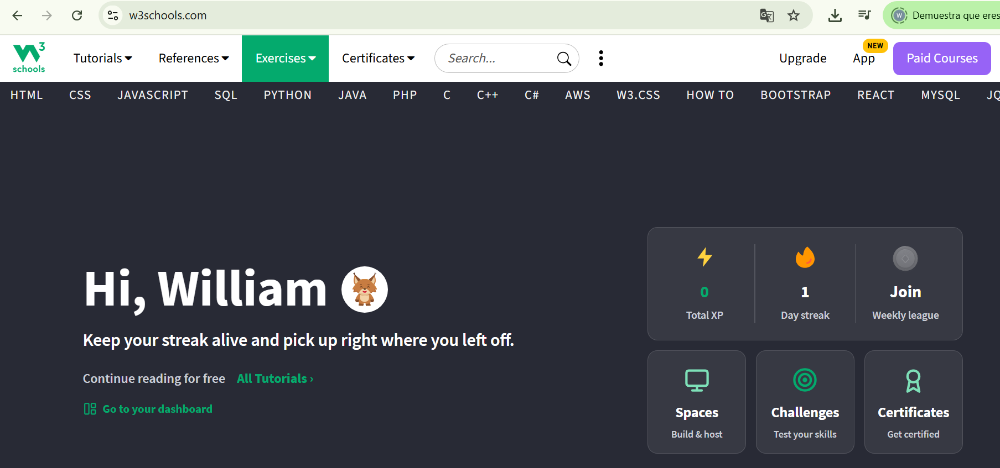

## 2. Unidad 1: Modelado dimensional

El modelado dimensional es una técnica de diseño de bases de datos
orientada al análisis y la inteligencia de negocios. Su objetivo es
organizar los datos de la forma en que el negocio los entiende,
facilitando consultas rápidas y comprensibles.

### 2.1. Hechos y dimensiones

-   **Hechos** → Representan lo que se mide (ventas, ingresos, costos).

-   **Dimensiones** → Representan las perspectivas desde las cuales se
    analizan los hechos (tiempo, producto, cliente, región).

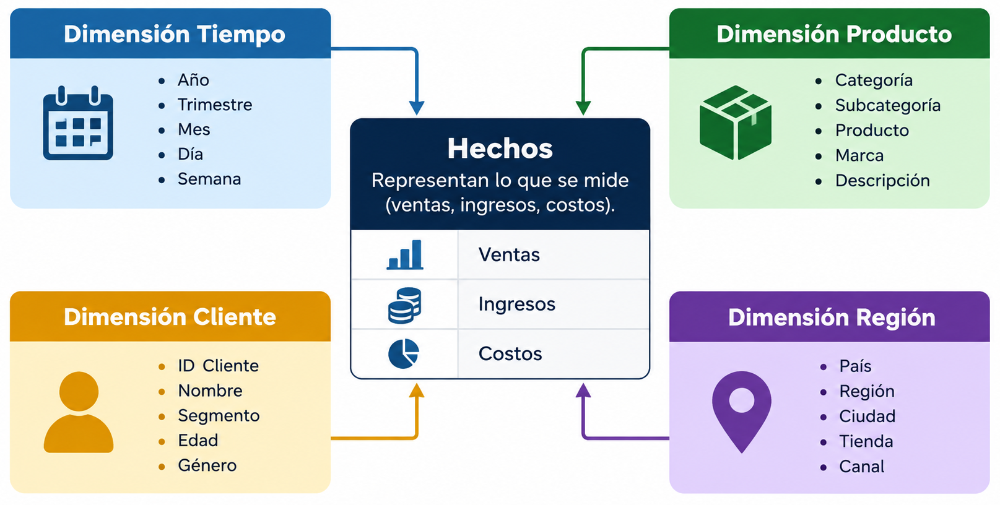

**Ejemplo de Balance Aseguradoras**

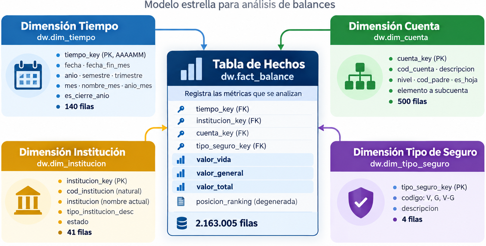

### Práctica

-   **Requisitos:**

1.  Tener Instalado PostgreSQL

2.  Tener Instalado DBeaver

**Bases de datos**

Utilizaremos la base de datos de Superintendencia de Bancos- Balances
Financieros.

-   [Descargar
    Base](https://drive.google.com/file/d/1niIyI8eDfvlhB-G_03LIMfW0XZBV-vJp/view?usp=sharing)

-   **Abrimos DBeaver**

-   Hacemos clic en Nueva conexión de base de datos

    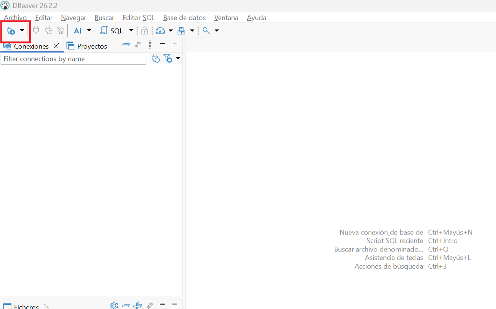

-   Seleccionamos PostgreSQL

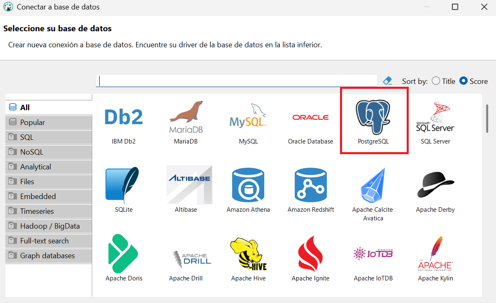

-   Seleccionamos Driver Standard y clic en continuar.

    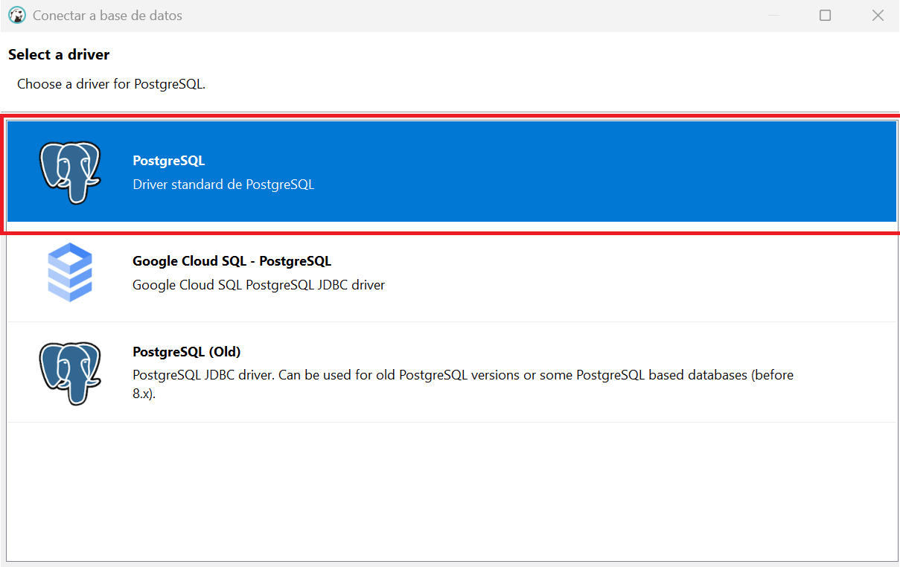

-   Damos clic en Show all databses y colocamos la clave que utilizamos
    al instalar

-   Clic en Finalizar

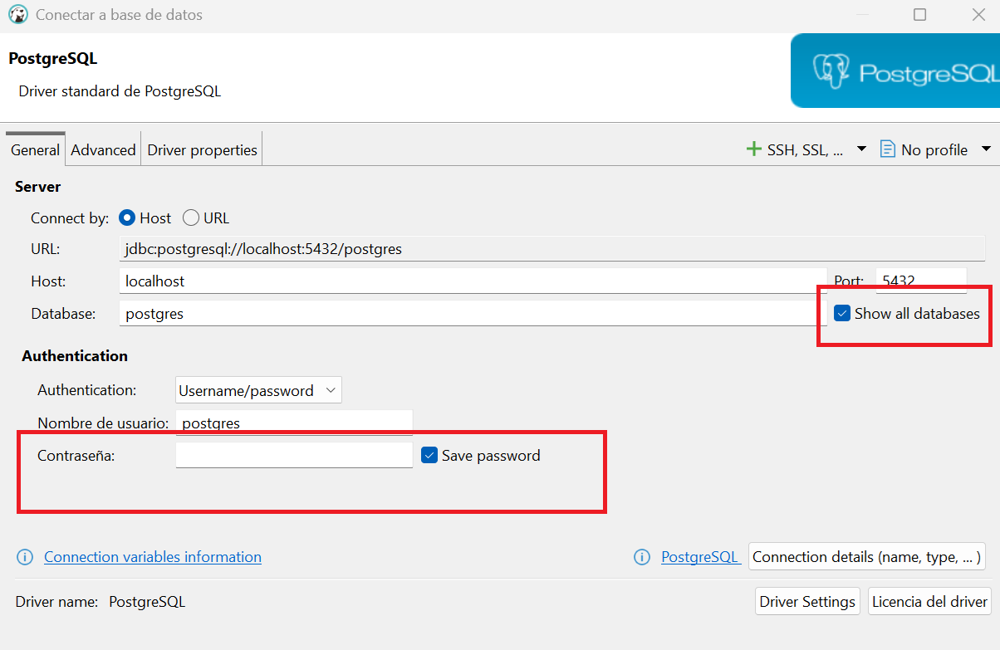

-   Verificamos que la conexión se haya realizado

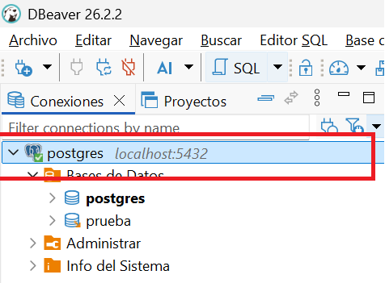

**Vamos con nuestro primer comando...**

-   Hacer clic derecho sobre postgres (Figura del Elefante), Editor SQL,
    Script SQL

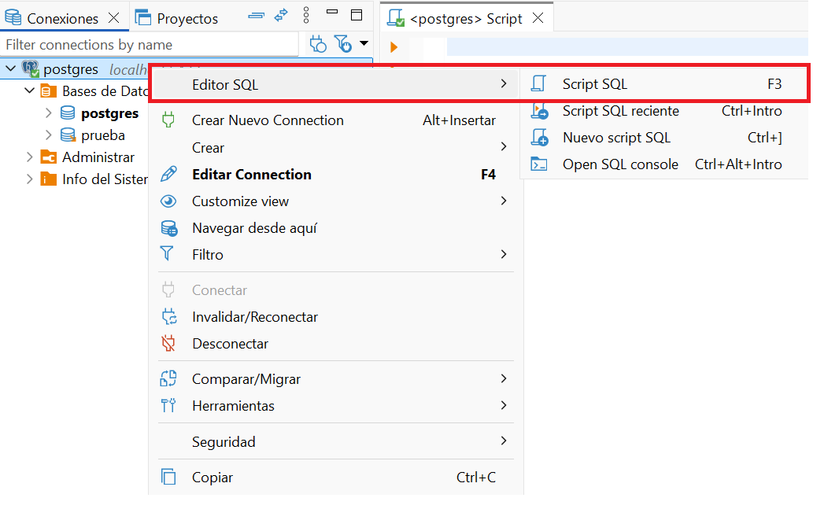

**Dentro del Script escribimos lo siguinte:**

1.  **Creamos la base de datos bi_seguros**

``` sql
CREATE DATABASE bi_seguros;
```

\*Debemos crear las tablas en la base correcta.

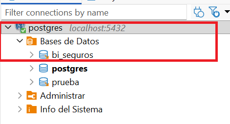

2.  **Creamos los esquemas**

    Vamos a organizar la base en tres esquemas, que son como carpetas:
    `staging` para los datos crudos tal como llegan, `dw` para el modelo
    limpio que usará Power BI, y `kpi` para los indicadores.

    Esta separación por capas es la que vieron en el Módulo 2.

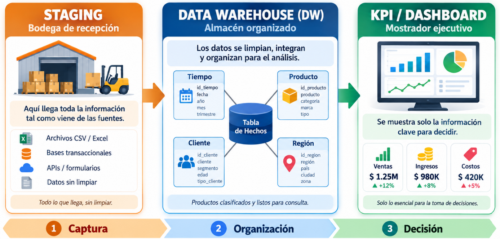

**Por qué utilizamos esquemas? tiene alguna lógica?...**

-   **Organización lógica:** Los esquemas funcionan como “carpetas”
    dentro de la base. Permiten separar las tablas según el área de
    negocio (cartera, depósitos, balances) o según la capa de
    procesamiento (staging, dw, kpi).

-   **Seguridad y control de acceso:** Puedes dar permisos distintos por
    esquema.

    Ejemplo: El área de riesgos accede solo al esquema *cartera*,
    mientras que contabilidad accede a *balances*.

-   **Mantenibilidad:** Si mañana necesitas modificar el modelo de
    *depósitos*, no afectas directamente las tablas de *cartera*. Cada
    esquema evoluciona de manera más independiente.

-   **Escalabilidad:** En bancos y aseguradoras, los datos suelen crecer
    mucho. Separar por esquemas evita que todo quede mezclado en un
    único espacio y facilita la administración.

-   **Claridad para los usuarios:** Cuando un analista abre la base y ve
    `cartera.clientes`,
    `depositos.transacciones`,`balances.estado_resultados`, entiende
    inmediatamente de qué área provienen los datos.

### Comparación de enfoques

| Enfoque | Ventajas | Desventajas |
|----|----|----|
| **Un solo esquema con todas las tablas** | Simplicidad inicial, menos configuración | Se vuelve caótico en bases grandes, difícil de dar permisos granulares |
| **Varios esquemas por área de negocio (cartera, depósitos, balances)** | Organización clara, seguridad por área, facilita auditoría | Puede haber redundancia si no se define bien la relación entre áreas |
| **Varios esquemas por capa (staging, dw, kpi)** | Orden en el flujo de datos, separación técnica, facilita BI | Requiere disciplina en ETL y gobernanza |

Crear esquemas es recomendable porque aporta orden, seguridad y
claridad, especialmente en organizaciones grandes como bancos o
aseguradoras. La decisión de si dividir por área de negocio (cartera,
depósitos, balances) o por capa técnica (staging, dw, kpi) depende del
objetivo:

-   Si buscas gobernanza y permisos, conviene por área.

-   Si buscas flujo analítico limpio, conviene por capas.

3.  **Creación de esquemas y tabla de staging**

``` sql
CREATE SCHEMA IF NOT EXISTS staging;
CREATE SCHEMA IF NOT EXISTS dw;
CREATE SCHEMA IF NOT EXISTS kpi;

CREATE TABLE IF NOT EXISTS staging.reportes_raw (
    cod_cuenta         TEXT,
    descripcion_cuenta TEXT,
    institucion        TEXT,
    valor_vida         TEXT,
    valor_general      TEXT,
    mes                TEXT,
    anio               TEXT,
    tipo_seguro        TEXT,
    tipo_registro      TEXT,
    cod_institucion    TEXT,
    tipo_institucion   TEXT,
    valor_total        TEXT,
    posicion_ranking   TEXT
);
```

-   Organiza la base en tres esquemas (staging, dw, kpi).

-   Limpia la tabla `reportes_raw` si ya existía.

-   Crea una nueva tabla `reportes_raw` en el esquema `staging` para
    recibir datos crudos.

**Por qué cargar todo como TEXT?**

Se carga como texto en staging para no perder nada y garantizar que todo
entra, y luego en el DW se hace la limpieza y tipado correcto.

4.  **Verificamos la carga**

``` sql
SELECT COUNT(*) AS filas FROM staging.reportes_raw;
```

El archivo tiene 3.004.600 líneas; la primera es el encabezado y no se
carga; por lo que vemos 3.004.599,

5.  **Medimos el universo**

``` sql
SELECT COUNT(DISTINCT cod_institucion)     AS aseguradoras,
       COUNT(DISTINCT institucion)         AS nombres_distintos,
       COUNT(DISTINCT cod_cuenta)          AS cuentas,
       COUNT(DISTINCT anio || '-' || mes)  AS periodos,
       MIN(anio || '-' || mes)             AS desde,
       MAX(anio || '-' || mes)             AS hasta
FROM staging.reportes_raw;
```

"Hay 40 códigos de aseguradora pero 49 nombres. ¿Cómo puede ser?"

6.  **Conocer las columnas de categoría**

``` sql
SELECT tipo_registro, COUNT(*) AS filas, COUNT(DISTINCT cod_cuenta) AS cuentas
FROM staging.reportes_raw GROUP BY 1 ORDER BY 1;
```

B con 2.163.005 filas y 499 cuentas; R con 841.594 filas y 167 cuentas.
B son las cuentas del balance contable: activo, pasivo, patrimonio,
ingresos, egresos. R son registros complementarios: indicadores ya
calculados (por ejemplo 46-53, siniestros menos recuperaciones) y anexos
con códigos como SEGN005. Para el modelo usaremos B, que es la
contabilidad oficial.

``` sql
SELECT tipo_seguro, tipo_institucion, COUNT(DISTINCT cod_institucion) AS aseguradoras, COUNT(*) AS filas
FROM staging.reportes_raw GROUP BY 1, 2 ORDER BY 1, 2;
```

`tipo_seguro` dice qué ramos opera la aseguradora: solo Vida, solo
Generales o ambos. `tipo_institucion` distingue el tipo de entidad: 15
son las compañías de seguros nacionales, 16 aparece en sucursales de
compañías extranjeras (Pan American Life Insurance Company, Coface) y 17
en reaseguradoras (Reaseguradora del Ecuador, Universal)

7.  **Una aseguradora con varios nombres**

``` sql
SELECT cod_institucion, string_agg(DISTINCT institucion, ' | ') AS nombres
FROM staging.reportes_raw
GROUP BY cod_institucion
HAVING COUNT(DISTINCT institucion) > 1;
```

Las empresas cambian de nombre, se fusionan o entran en liquidación. Si
usáramos el nombre como identificador, Liberty y Atlántida parecerían
dos empresas distintas y su historia se partiría en dos. Por eso la
clave de una aseguradora es su código, no su nombre.

8.  **Verificamos que los números son números**

``` sql
SELECT COUNT(*) AS valores_invalidos
FROM staging.reportes_raw
WHERE valor_total   !~ '^-?[0-9]+(\.[0-9]+)?$'
   OR valor_vida    !~ '^-?[0-9]+(\.[0-9]+)?$'
   OR valor_general !~ '^-?[0-9]+(\.[0-9]+)?$';
```

-   !\~: operador de PostgreSQL que significa “no coincide con la
    expresión regular”.

-   Regex \^-?\[0-9\]+(.\[0-9\]+)?\$: valida números enteros o
    decimales, positivos o negativos.

-   La consulta cuenta todas las filas donde alguna de las tres columnas
    (valor_total, valor_vida, valor_general) no es un número válido

-   Si el conteo devuelve un número mayor a 0, significa que tienes
    registros con problemas de calidad (vacíos, texto, símbolos,
    formatos incorrectos).

-   Si devuelve 0, significa que todos los valores cumplen el patrón
    numérico.

9.  **Inspeccionamos cuales son esos valores inválidos**

``` sql
SELECT cod_institucion,
       valor_total,
       valor_vida,
       valor_general
FROM staging.reportes_raw
WHERE valor_total   !~ '^-?[0-9]+(\.[0-9]+)?$'
   OR valor_vida    !~ '^-?[0-9]+(\.[0-9]+)?$'
   OR valor_general !~ '^-?[0-9]+(\.[0-9]+)?$'
LIMIT 50;
```

\*Podemos verificar donde estan los errores

``` sql
--Verificamos cuantos errores hay en columnas 

SELECT
    COUNT(*) FILTER (
        WHERE valor_total !~ '^-?[0-9]+(\.[0-9]+)?$'
    ) AS invalidos_total,

    COUNT(*) FILTER (
        WHERE valor_vida !~ '^-?[0-9]+(\.[0-9]+)?$'
    ) AS invalidos_vida,

    COUNT(*) FILTER (
        WHERE valor_general !~ '^-?[0-9]+(\.[0-9]+)?$'
    ) AS invalidos_general

FROM staging.reportes_raw;
```

Podemos limpiar esos errores

``` sql
UPDATE staging.reportes_raw
SET valor_general = NULL
WHERE TRIM(valor_general) = '';

UPDATE staging.reportes_raw
SET valor_vida = NULL
WHERE TRIM(valor_vida) = '';

UPDATE staging.reportes_raw
SET valor_total = NULL
WHERE TRIM(valor_total) = '';
```

10. **Buscamos filas repetidas**

``` sql
SELECT COUNT(*) AS filas_totales,
       (SELECT COUNT(*) FROM (SELECT DISTINCT * FROM staging.reportes_raw) d) AS filas_unicas
FROM staging.reportes_raw;
```

3.004.599 filas totales y 2.598.345 únicas. Es decir, 406.254 filas son
copias exactas de otras. Esta consulta tarda unos segundos: está
comparando 3 millones de filas.

``` sql
SELECT tipo_registro, cod_cuenta,
       COUNT(*) - COUNT(DISTINCT (cod_institucion, anio, mes)) AS sobrantes
FROM staging.reportes_raw
GROUP BY 1, 2
HAVING COUNT(*) > COUNT(DISTINCT (cod_institucion, anio, mes))
ORDER BY sobrantes DESC
LIMIT 10;
```

Si hubiéramos sumado sin revisar, cualquier indicador basado en SEGN005
estaría inflado cientos de veces. Y miren: el balance (B) no tiene ni
una repetida. Otra razón para construir el modelo sobre B.

11. **Verifiquemos si el total es correcto.**

``` sql
SELECT tipo_registro,
       SUM(CASE WHEN abs(valor_total::NUMERIC - (valor_vida::NUMERIC + valor_general::NUMERIC)) > 1
                THEN 1 ELSE 0 END) AS filas_descuadradas
FROM staging.reportes_raw
GROUP BY 1;
```

En el balance, Total siempre es Vida más Generales. En R no, porque
muchos registros R son razones o porcentajes, y una razón no se suma.

12. **Creamos una tabla limpia**

``` sql
DROP TABLE IF EXISTS staging.reportes CASCADE;
CREATE TABLE staging.reportes AS
SELECT DISTINCT
    btrim(cod_cuenta)                                   AS cod_cuenta,
    NULLIF(btrim(descripcion_cuenta), '')               AS descripcion_cuenta,
    upper(btrim(institucion))                           AS institucion,
    btrim(cod_institucion)::INTEGER                     AS cod_institucion,
    btrim(tipo_institucion)::SMALLINT                   AS tipo_institucion,
    btrim(tipo_seguro)                                  AS tipo_seguro,
    btrim(tipo_registro)                                AS tipo_registro,
    btrim(anio)::SMALLINT                               AS anio,
    btrim(mes)::SMALLINT                                AS mes,
    valor_vida::NUMERIC(20,2)                           AS valor_vida,
    valor_general::NUMERIC(20,2)                        AS valor_general,
    valor_total::NUMERIC(20,2)                          AS valor_total,
    NULLIF(btrim(posicion_ranking), '0')::INTEGER       AS posicion_ranking
FROM staging.reportes_raw;

ANALYZE staging.reportes;

-- Controles
SELECT tipo_registro, COUNT(*) AS filas FROM staging.reportes GROUP BY 1;

SELECT COUNT(*) AS filas_b,
       COUNT(DISTINCT (cod_institucion, cod_cuenta, anio, mes)) AS combinaciones_unicas_b
FROM staging.reportes
WHERE tipo_registro = 'B';
```

Toda pregunta de negocio tiene dos partes:

-   Qué medimos y por qué lo cortamos.

-   '¿Cuánta prima emitió cada aseguradora en 2025?' mide prima (un
    número que se suma) y la corta por aseguradora y por año.

-   Lo que se mide se llama hecho o medida; lo que sirve para cortar,
    filtrar o agrupar se llama dimensión. La prueba rápida es
    preguntarse de cada columna: ¿la sumo o la uso para filtrar?

Veamos con nuestra base..

| **Columna** | **¿Se suma o se filtra?** | **Va a…** |
|----|----|----|
| valor_vida, valor_general, valor_total |  | Medidas del hecho |
| cod_institucion, institucion, tipo_institucion |  |  |
| cod_cuenta, descripcion_cuenta |  |  |
| anio, mes |  |  |
| tipo_seguro |  |  |
| posicion_ranking |  |  |
| tipo_registro | Se usa para elegir filas | No va al modelo (solo cargamos B) |

**¿Por qué no sumamos `posicion_ranking`?**

1.  Contar los miembros de cada dimensión.

``` sql
SELECT 'aseguradora' AS atributo, COUNT(DISTINCT cod_institucion) AS miembros FROM staging.reportes WHERE tipo_registro = 'B'
UNION ALL SELECT 'cuenta',      COUNT(DISTINCT cod_cuenta)    FROM staging.reportes WHERE tipo_registro = 'B'
UNION ALL SELECT 'periodo',     COUNT(DISTINCT (anio, mes))   FROM staging.reportes WHERE tipo_registro = 'B'
UNION ALL SELECT 'tipo_seguro', COUNT(DISTINCT tipo_seguro)   FROM staging.reportes WHERE tipo_registro = 'B';
```

Qué deben ver: 40 aseguradoras, 499 cuentas, 140 periodos y 3 tipos de
seguro.

Fíjense en la diferencia de tamaños: las dimensiones son pequeñas (40,
499, 140, 3) y el hecho es enorme (2,1 millones). Así es casi siempre:
pocas cosas que describen, muchísimas mediciones.

### 2.2. Jerarquías

Una jerarquía es una ruta de resumen dentro de una dimensión, que va de
lo general a lo particular. Permite navegar los datos en dos
direcciones:

-   **Roll-up:** Subir de nivel (ej. de mes a trimestre, de trimestre a
    año).

-   **Drill-down:** bajar al detalle (ej. de año a trimestre, de
    trimestre a mes, de mes a día).

Las jerarquías son esenciales en BI porque permiten analizar la misma
métrica en distintos niveles de agregación.

**Conceptos clave**

-   **Jerarquía balanceada:** Todas las ramas tienen la misma
    profundidad.

    Ejemplo: Tiempo → Año → Trimestre → Mes → Día.

-   **Jerarquía irregular (ragged):** Las ramas terminan en niveles
    distintos.

    Ejemplo: Un plan de cuentas contable, donde algunas cuentas llegan
    hasta nivel 5 y otras solo hasta nivel 3.

-   **Jerarquía padre-hijo:** Cada miembro conoce a su padre mediante un
    campo como `cod_padre`.

    Ejemplo: estructura organizacional (Gerente → Jefe → Analista).

-   **Aplanar una jerarquía:** Guardar una columna por nivel (ej.
    `nivel1`, `nivel2`, `nivel3`) para que las herramientas de BI puedan
    recorrerla fácilmente.

-   **Riesgo de doble conteo:** Si los datos existen en varios niveles,
    sumar niveles distintos puede duplicar valores.

    Ejemplo: sumar ventas por categoría y por producto sin cuidado puede
    inflar el resultado.

**Con nuestra base**

En el caso de códigos contables, el código crece dos dígitos por nivel:

-   Nivel 1: `1` → Activos.

-   Nivel 2: `11` → Activos corrientes.

-   Nivel 3: `1101` → Caja y bancos.

Esto refleja una jerarquía padre-hijo, donde cada nivel se construye
concatenando el código del nivel superior.

**✅ Conclusión**

Las jerarquías permiten que los usuarios naveguen los datos de manera
intuitiva, desde un resumen global hasta el detalle más específico.

-   Son fundamentales para el análisis en BI.

-   Deben diseñarse con cuidado para evitar doble conteo y asegurar que
    las herramientas de análisis (como Power BI) las interpreten
    correctamente.

``` sql
SELECT length(cod_cuenta) AS digitos,
       COUNT(DISTINCT cod_cuenta) AS cuentas,
       MIN(cod_cuenta) AS ejemplo
FROM staging.reportes
WHERE tipo_registro = 'B'
GROUP BY 1 ORDER BY 1;  
```

-   Aquí podemos identificar

-   Elementos Grupo Cuenta Subcuenta Auxiliar

-   Podemos trabajar con códigos

``` sql
SELECT DISTINCT cod_cuenta, descripcion_cuenta, length(cod_cuenta) AS digitos
FROM staging.reportes
WHERE tipo_registro = 'B'
  AND cod_cuenta IN ('1', '11', '1101', '110101', '11010101')
ORDER BY cod_cuenta;
```

Cada nivel es la suma de sus hijos.

Comprobémoslo con números en un momento. La consecuencia práctica es
enorme: si sumamos la cuenta 1 y la cuenta 11, contamos las inversiones
dos veces.

En el modelo tendremos que saber siempre en qué nivel estamos.

**Tenemos padres completos**

``` sql
WITH c AS (SELECT DISTINCT cod_cuenta FROM staging.reportes WHERE tipo_registro = 'B')
SELECT h.cod_cuenta
FROM c h
WHERE length(h.cod_cuenta) > 1
  AND NOT EXISTS (SELECT 1 FROM c p
                  WHERE p.cod_cuenta = CASE WHEN length(h.cod_cuenta) = 2 THEN left(h.cod_cuenta, 1)
                                            ELSE left(h.cod_cuenta, length(h.cod_cuenta) - 2) END);
```

**Validamos jerarquías**

Las tres jerarquías del modelo:

-   Cuenta: elemento → grupo → cuenta → subcuenta → auxiliar.

-   Tiempo: año → semestre → trimestre → mes.

-   Institución: tipo de institución (compañía, sucursal extranjera,
    reaseguradora) → aseguradora.

### 2.3. Granularidad

El grano es el nivel de detalle de una fila en la tabla de hechos. Antes
de elegir dimensiones y medidas, se debe declarar el grano en una frase.
Todas las medidas deben estar en ese mismo grano para evitar
inconsistencias.

**Grano atómico:**

-   Es el máximo detalle disponible.

-   Permite responder preguntas que todavía no se han planteado.

-   Ejemplo: cada transacción individual en un banco.

**Declaración del grano:**

-   Se expresa como: *“una fila representa…”*.

-   Ejemplo: *“una fila representa una venta de un producto a un cliente
    en una fecha determinada”*.

-   Si dos filas tienen la misma combinación de claves, el grano está
    mal declarado o hay duplicados,

**Tipos de tabla de hechos según el grano:**

-   **Transaccional:** un evento por fila (ej. cada compra, cada pago).

-   **Instantánea periódica:** una foto por periodo (ej. saldos
    mensuales de cuentas).

-   **Instantánea acumulativa:** un proceso con varias fechas (ej.
    evolución de un préstamo desde inicio hasta fin).

-   **Mezclar granos:**

    -   Ejemplo: datos mensuales y anuales en la misma tabla.

    -   Produce totales incorrectos porque se suman niveles distintos.

En el caso de **aseguradoras**:

-   **Declaración del grano:** *“una fila representa una cuenta de una
    aseguradora en un mes”*.

-   Esto corresponde a una instantánea periódica mensual.

-   Por eso los saldos no se deben sumar entre meses, ya que cada fila
    es una foto independiente del estado de la cuenta.

**✅ Conclusión**

La granularidad es el corazón del modelado dimensional:

-   Define el nivel de detalle de los hechos.

-   Garantiza consistencia en las medidas.

-   Evita errores de duplicación o doble conteo.

-   Permite que los KPIs reflejen correctamente la realidad del negocio.

El grano es la respuesta a: ¿qué representa una fila? Se declara antes
de diseñar nada, en una frase. La nuestra será:

Una fila = el valor de una cuenta contable, reportado por una
aseguradora, en un mes.

**Comprobemos el grano**

``` sql
SELECT COUNT(*) AS filas,
       COUNT(DISTINCT (cod_institucion, cod_cuenta, anio, mes)) AS combinaciones_unicas
FROM staging.reportes
WHERE tipo_registro = 'B';
```

2.163.005 y 2.163.005.

Si fueran distintos, la frase del grano estaría mal: faltaría algo que
distingue a dos filas.

Ahora la pregunta más importante del módulo: ¿Todas las medidas se
pueden sumar en cualquier dirección?

``` sql
SELECT mes,
       ROUND(SUM(valor_total) FILTER (WHERE cod_cuenta = '1')  / 1e6, 1) AS activo_millones,
       ROUND(SUM(valor_total) FILTER (WHERE cod_cuenta = '51') / 1e6, 1) AS prima_emitida_millones
FROM staging.reportes
WHERE tipo_registro = 'B' AND anio = 2025
GROUP BY mes
ORDER BY mes;
```

El activo se mantiene alrededor de 2.700 millones: es un saldo, una foto
del día. La prima crece mes a mes: es un acumulado del año, enero más
febrero más marzo… ¿Qué pasa si sumamos los 12 meses del activo? Nos
daría 32.000 millones: un número que no existe. ¿Y si sumamos los 12
meses de la prima? Contaríamos enero doce veces.

**✅ Conclusión**:

Valor_total es una medida semiaditiva. Se puede sumar entre aseguradoras
(el activo del sistema es la suma de los activos de cada una) pero en el
tiempo no se suma: se toma el último mes del periodo. El total de 2025
es el valor de diciembre; el de 2026 hasta hoy es el de agosto.

Cuadre de cuentas

``` sql
SELECT ROUND(SUM(valor_total) FILTER (WHERE cod_cuenta = '1') / 1e6, 1) AS activo,
       ROUND(SUM(valor_total) FILTER (WHERE cod_cuenta = '2') / 1e6, 1) AS pasivo,
       ROUND(SUM(valor_total) FILTER (WHERE cod_cuenta = '3') / 1e6, 1) AS patrimonio
FROM staging.reportes
WHERE tipo_registro = 'B' AND anio = 2025 AND mes = 12;
```

La contabilidad cuadra, los datos son confiables.

### 2.3. Modelos Analíticos

Los sistemas que **registran operaciones (OLTP)** y los que **analizan
información (OLAP)** tienen necesidades opuestas, y por eso se modelan
distinto:

-   **OLTP:** optimizado para escribir rápido y mantener integridad.

-   **OLAP:** optimizado para leer rápido y facilitar análisis.

**🔑 Conceptos clave**

-   **OLTP (Online Transaction Processing):**

    -   Muchas transacciones pequeñas.

    -   Modelo **normalizado (3FN)** para evitar redundancia.

    -   Prioriza la **integridad al escribir**.

    -   Ejemplo: sistema bancario que registra cada pago o
        transferencia.

-   **OLAP (Online Analytical Processing):**

    -   Pocas consultas grandes de lectura.

    -   Modelo **dimensional** (estrella, copo de nieve).

    -   Prioriza la **velocidad al leer**.

    -   Ejemplo: dashboard de ventas que calcula KPIs por región y
        producto.

🏛 **Enfoques de Data Warehouse**

-   **Inmon:** almacén corporativo normalizado → de ahí salen *data
    marts* temáticos.

-   **Kimball:** *data marts* dimensionales integrados por **dimensiones
    conformadas** (comparten las mismas definiciones de cliente,
    producto, tiempo).

👉 ***En la práctica, Kimball es más usado en BI porque es más directo
para análisis.***

**📐 Formas del modelo**

-   **Tabla plana:** todos los datos en una sola tabla (simple pero poco
    eficiente).

-   **Estrella (Star Schema):** tabla de hechos central + dimensiones
    desnormalizadas.

-   **Copo de nieve (Snowflake):** dimensiones normalizadas en varias
    tablas.

-   **Constelación:** varias tablas de hechos que comparten dimensiones
    (ej. ventas y devoluciones).

🔄 **Dimensiones lentamente cambiantes (SCD)**

Las dimensiones cambian con el tiempo (ej. nombre de cliente,
dirección).

-   **Tipo 1:** sobrescribe el valor (no guarda historia).

-   **Tipo 2:** guarda una fila por versión (histórico completo).

-   **Tipo 3:** guarda el valor anterior en otra columna (historia
    limitada).

📊 **Con nuestra base**

-   El CSV inicial es una tabla plana.

-   Lo transformamos en un modelo estrella para análisis.

-   Los nombres cambiantes de las aseguradoras se resuelven con SCD tipo
    1 (sobrescribir valor).

✅ Conclusión

-   OLTP y OLAP son complementarios: uno registra operaciones, el otro
    analiza.

-   El modelo estrella es la base del BI porque simplifica y acelera las
    consultas.

-   Los enfoques de Inmon y Kimball ofrecen estrategias distintas, pero
    ambos buscan integrar la información.

-   Las dimensiones lentamente cambiantes son clave para manejar la
    evolución de los datos en el tiempo.

**En nuestro ejemplo:**

Qué nombre ponemos a la aseguradora 1107: HDI, Liberty o Atlántida? Hay
dos escuelas. Tipo 1: guardamos solo el nombre más reciente y toda la
historia aparece como Atlántida. Tipo 2: guardamos una fila por cada
nombre con fechas de vigencia.

Para un ranking del sistema, el tipo 1 es suficiente y es lo que
haremos. A esto se le llama dimensión lentamente cambiante (SCD).

### 2.5 Casos prácticos

📌 **Idea central**

Todo diseño dimensional sigue los **cuatro pasos de Kimball**:

1.  **Elegir el proceso de negocio** → seleccionar una actividad que
    genera mediciones.

2.  **Declarar el grano** → definir el nivel de detalle de la tabla de
    hechos.

3.  **Identificar las dimensiones** → establecer las perspectivas de
    análisis.

4.  **Identificar los hechos** → definir las métricas que se van a
    medir.

👉 Estos pasos aseguran que el modelo refleje la lógica del negocio y
sea útil para análisis.

**🔑 Conceptos clave**

-   **Proceso de negocio:** Es la actividad que genera datos medibles.
    Ejemplos: vender productos, pagar siniestros, reportar balances.

-   **Matriz de bus:** Es una tabla que organiza los procesos (filas)
    frente a las dimensiones (columnas). Sirve para planificar todo el
    almacén de datos y asegurar consistencia.

-   **Dimensión conformada:** Es una dimensión compartida por varios
    procesos, lo que permite cruzar información. Ejemplo: la dimensión
    *Tiempo* usada tanto en ventas como en balances.

📊 **Con nuestra base**

-   **Proceso:** reporte mensual del balance de las aseguradoras a la
    Superintendencia de Compañías.

-   **Grano:** una fila representa *una cuenta de una aseguradora en un
    mes*.

-   **Dimensiones:** aseguradora, tiempo, tipo de cuenta, región.

-   **Hechos:** saldos, ingresos, egresos, patrimonio.

👉 Este caso corresponde a una instantánea periódica mensual, donde cada
fila es una foto del estado financiero de la aseguradora en un periodo.

**✅ Conclusión**

Los casos prácticos permiten aplicar la teoría del modelado dimensional
a situaciones reales:

-   Se parte de un proceso de negocio claro.

-   Se declara el grano para evitar duplicados.

-   Se identifican dimensiones y hechos para estructurar el análisis.

-   Se construye una matriz de bus que asegura que los distintos
    procesos compartan dimensiones conformadas.

## 3. Unidad 2: Esquema Estrella

Diseñar esquemas estrella para mejorar el rendimiento en consultas. Al
final de la sesión existe el esquema dw con cuatro dimensiones y la
tabla de hechos fact_balance, cuadrada al centavo con staging.

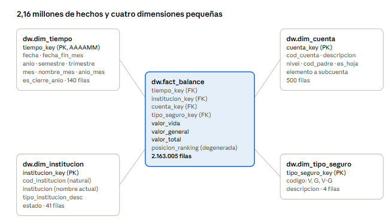

**Vamos a crear las tablas**

``` sql
CREATE TABLE dw.dim_tiempo (
    tiempo_key SERIAL PRIMARY KEY,
    anio       INTEGER NOT NULL,
    mes        INTEGER NOT NULL
);

CREATE TABLE dw.dim_institucion (
    institucion_key SERIAL PRIMARY KEY,
    cod_institucion TEXT NOT NULL,
    institucion     TEXT,
    tipo_institucion TEXT
);

CREATE TABLE dw.dim_cuenta (
    cuenta_key SERIAL PRIMARY KEY,
    cod_cuenta TEXT NOT NULL,
    descripcion_cuenta TEXT
);

CREATE TABLE dw.dim_tipo_seguro (
    tipo_seguro_key SERIAL PRIMARY KEY,
    tipo_seguro TEXT NOT NULL
);
```

**Creamos la tabla de hechos**

``` sql
CREATE TABLE dw.fact_balance (
    tiempo_key        INTEGER NOT NULL REFERENCES dw.dim_tiempo (tiempo_key),
    institucion_key   INTEGER NOT NULL REFERENCES dw.dim_institucion (institucion_key),
    cuenta_key        INTEGER NOT NULL REFERENCES dw.dim_cuenta (cuenta_key),
    tipo_seguro_key   INTEGER NOT NULL REFERENCES dw.dim_tipo_seguro (tipo_seguro_key),
    valor_vida        NUMERIC(20,2) NOT NULL,
    valor_general     NUMERIC(20,2) NOT NULL,
    valor_total       NUMERIC(20,2) NOT NULL,
    posicion_ranking  INTEGER, -- dimensión degenerada
    PRIMARY KEY (tiempo_key, institucion_key, cuenta_key)
);
```

**Este es un excelente ejemplo:**

-   Orden de creación importa → primero las dimensiones, luego la tabla
    de hechos.

-   Llaves foráneas aseguran integridad → no puedes cargar un hecho si
    no existe la dimensión correspondiente.

-   Modelo estrella → las dimensiones describen el hecho, y el hecho
    guarda las medidas.

**Un paso adicional**

Limpiar (por si se repite la sesión):

``` sql
DROP TABLE IF EXISTS dw.fact_balance CASCADE;
DROP TABLE IF EXISTS dw.dim_tiempo, dw.dim_institucion, dw.dim_cuenta, dw.dim_tipo_seguro CASCADE;
```

**Vamos a crear la dimensión tiempo**

La dimensión Tiempo no se copia de los datos: se genera con todos los
meses desde el primero hasta el último, sin huecos. generate_series crea
una fila por mes.

Si un mes faltara en los datos, igual existiría en el calendario, y eso
nos permitirá detectar meses sin reporte

``` sql
CREATE TABLE dw.dim_tiempo (
    tiempo_key      INTEGER PRIMARY KEY,          -- AAAAMM, ej. 202608
    fecha           DATE NOT NULL UNIQUE,         -- primer día del mes
    fecha_fin_mes   DATE NOT NULL,
    anio            SMALLINT NOT NULL,
    semestre        SMALLINT NOT NULL,
    trimestre       SMALLINT NOT NULL,
    mes             SMALLINT NOT NULL,
    nombre_mes      VARCHAR(12) NOT NULL,
    anio_mes        CHAR(7) NOT NULL,             -- '2026-08'
    es_cierre_anio  BOOLEAN NOT NULL
);
INSERT INTO dw.dim_tiempo
SELECT  to_char(f, 'YYYYMM')::INTEGER,
        f::DATE,
        (f + INTERVAL '1 month - 1 day')::DATE,
        EXTRACT(YEAR FROM f),
        CASE WHEN EXTRACT(MONTH FROM f) <= 6 THEN 1 ELSE 2 END,
        EXTRACT(QUARTER FROM f),
        EXTRACT(MONTH FROM f),
        (ARRAY['Enero','Febrero','Marzo','Abril','Mayo','Junio','Julio',
               'Agosto','Septiembre','Octubre','Noviembre','Diciembre'])[EXTRACT(MONTH FROM f)::INT],
        to_char(f, 'YYYY-MM'),
        EXTRACT(MONTH FROM f) = 12
FROM generate_series(
        (SELECT make_date(MIN(anio), 1, 1) FROM staging.reportes),
        (SELECT make_date(MAX(anio), MAX(mes) FILTER (WHERE anio = (SELECT MAX(anio) FROM staging.reportes)), 1)
         FROM staging.reportes),
        INTERVAL '1 month') AS f;

SELECT * FROM dw.dim_tiempo ORDER BY tiempo_key DESC LIMIT 3;
```

**Creamos la dimensión institución**

Aquí aplicamos lo que descubrimos: la clave natural es cod_institucion y
el nombre que mostramos es el más reciente (SCD tipo 1). DISTINCT ON
toma, para cada código, la primera fila según el orden indicado: la del
año y mes más altos.

Además guardamos todos los nombres históricos en una columna, para no
perder la información, y calculamos si la aseguradora sigue activa.

``` sql
CREATE TABLE dw.dim_institucion (
    institucion_key     INTEGER GENERATED BY DEFAULT AS IDENTITY PRIMARY KEY,
    cod_institucion     INTEGER NOT NULL UNIQUE,
    institucion         VARCHAR(200) NOT NULL,       -- nombre más reciente
    nombres_historicos  TEXT,
    tipo_institucion    SMALLINT,
    tipo_institucion_desc VARCHAR(60),
    primer_periodo      INTEGER,
    ultimo_periodo      INTEGER,
    estado              VARCHAR(30)
);
INSERT INTO dw.dim_institucion (institucion_key, cod_institucion, institucion, estado)
VALUES (-1, -1, 'NO IDENTIFICADA', 'N/D');

INSERT INTO dw.dim_institucion (cod_institucion, institucion, nombres_historicos, tipo_institucion,
                                tipo_institucion_desc, primer_periodo, ultimo_periodo, estado)
SELECT  r.cod_institucion,
        r.institucion,
        h.nombres,
        r.tipo_institucion,
        CASE r.tipo_institucion WHEN 15 THEN 'Compañía de seguros'
                                WHEN 16 THEN 'Sucursal de compañía extranjera'
                                WHEN 17 THEN 'Reaseguradora'
                                ELSE 'Otro' END,
        h.primer, h.ultimo,
        CASE WHEN h.ultimo = (SELECT MAX(anio * 100 + mes) FROM staging.reportes) THEN 'Activa'
             ELSE 'Sin reporte reciente' END
FROM (
    SELECT DISTINCT ON (cod_institucion) cod_institucion, institucion, tipo_institucion
    FROM staging.reportes
    WHERE tipo_registro = 'B'
    ORDER BY cod_institucion, anio DESC, mes DESC
) r
JOIN (
    SELECT cod_institucion,
           string_agg(DISTINCT institucion, ' | ') AS nombres,
           MIN(anio * 100 + mes) AS primer,
           MAX(anio * 100 + mes) AS ultimo
    FROM staging.reportes
    WHERE tipo_registro = 'B'
    GROUP BY cod_institucion
) h USING (cod_institucion)
ORDER BY r.cod_institucion;

SELECT cod_institucion, institucion, estado, ultimo_periodo
FROM dw.dim_institucion
WHERE cod_institucion IN (1107, 1087, 1105);
```

-   institucion_key = -1 → clave sustituta en la dimensión.

-   cod_institucion = -1 → valor artificial que no existe en los datos
    reales.

-   institucion = 'NO IDENTIFICADA' → etiqueta que describe que no se
    conoce la institución.

-   estado = 'N/D' → “No disponible”.

✅ Para qué sirve: Es un registro comodín o default en la dimensión.

Se usa cuando en la tabla de hechos (fact_balance) aparece un dato con
institución desconocida, nula o inválida.

-   Así evitas que la llave foránea falle y mantienes la integridad
    referencial.

-   En modelos dimensionales esto se llama “surrogate key para valores
    desconocidos” o “dummy member”.

-   Supón que en tus datos de staging tienes un registro con
    cod_institucion = NULL.

-   Al cargar al DW, en lugar de romper la relación, lo asignas a
    institucion_key = -1.

-   En los reportes, aparecerá como “NO IDENTIFICADA”.

-   Esto asegura que todas las filas de hechos tienen una dimensión
    asociada, incluso si la información original estaba incompleta.

**Cuantas aseguradoras estan activas hoy**

``` sql
SELECT estado, COUNT(*) FROM dw.dim_institucion GROUP BY estado
```

**Creamos la dimensión Seguros**

``` sql
CREATE TABLE dw.dim_tipo_seguro (
    tipo_seguro_key  INTEGER GENERATED BY DEFAULT AS IDENTITY PRIMARY KEY,
    codigo           VARCHAR(5) NOT NULL UNIQUE,
    descripcion      VARCHAR(40) NOT NULL
);
INSERT INTO dw.dim_tipo_seguro (tipo_seguro_key, codigo, descripcion) VALUES (-1, 'N/D', 'No identificado');
INSERT INTO dw.dim_tipo_seguro (codigo, descripcion)
SELECT DISTINCT tipo_seguro,
       CASE tipo_seguro WHEN 'V'   THEN 'Vida'
                        WHEN 'G'   THEN 'Generales'
                        WHEN 'V-G' THEN 'Vida y Generales'
                        ELSE 'Otro' END
FROM staging.reportes
ORDER BY 1;

SELECT * FROM dw.dim_tipo_seguro;
```

**Creamos la dimension cuenta con Jerarquía**

Esta es la dimensión más interesante. Para cada cuenta calculamos su
nivel según los dígitos, su padre quitando los dos últimos dígitos y el
nombre de cada uno de sus ancestros. A esto se le llama jerarquía
aplanada: en vez de obligar a Power BI a recorrer el árbol, le damos una
columna por nivel. Es la forma que Power BI necesita para hacer drill
down.

``` sql
CREATE TABLE dw.dim_cuenta (
    cuenta_key     INTEGER GENERATED BY DEFAULT AS IDENTITY PRIMARY KEY,
    cod_cuenta     VARCHAR(10) NOT NULL UNIQUE,
    descripcion    VARCHAR(300) NOT NULL,
    nivel          SMALLINT NOT NULL,          -- 1 elemento, 2 grupo, 3 cuenta, 4 subcuenta, 5 auxiliar
    cod_padre      VARCHAR(10),
    elemento       VARCHAR(60),                -- nivel 1 (Activo, Pasivo, ...)
    grupo          VARCHAR(300),               -- nivel 2
    cuenta         VARCHAR(300),               -- nivel 3
    subcuenta      VARCHAR(300),               -- nivel 4
    estado_financiero VARCHAR(30),             -- Balance general / Estado de resultados / Orden
    es_hoja        BOOLEAN NOT NULL DEFAULT TRUE
);
INSERT INTO dw.dim_cuenta (cuenta_key, cod_cuenta, descripcion, nivel) VALUES (-1, 'N/D', 'NO IDENTIFICADA', 0);

WITH c AS (
    SELECT DISTINCT cod_cuenta, descripcion_cuenta
    FROM staging.reportes
    WHERE tipo_registro = 'B'
)
INSERT INTO dw.dim_cuenta (cod_cuenta, descripcion, nivel, cod_padre, elemento, grupo, cuenta, subcuenta, estado_financiero)
SELECT  h.cod_cuenta,
        h.descripcion_cuenta,
        CASE length(h.cod_cuenta) WHEN 1 THEN 1 WHEN 2 THEN 2 WHEN 4 THEN 3 WHEN 6 THEN 4 ELSE 5 END,
        CASE length(h.cod_cuenta) WHEN 1 THEN NULL WHEN 2 THEN left(h.cod_cuenta, 1)
             ELSE left(h.cod_cuenta, length(h.cod_cuenta) - 2) END,
        CASE left(h.cod_cuenta, 1) WHEN '1' THEN 'Activo' WHEN '2' THEN 'Pasivo' WHEN '3' THEN 'Patrimonio'
                                   WHEN '4' THEN 'Egresos' WHEN '5' THEN 'Ingresos'
                                   WHEN '6' THEN 'Contingentes' WHEN '7' THEN 'Cuentas de orden' END,
        n2.descripcion_cuenta,
        n3.descripcion_cuenta,
        n4.descripcion_cuenta,
        CASE WHEN left(h.cod_cuenta, 1) IN ('1', '2', '3') THEN 'Balance general'
             WHEN left(h.cod_cuenta, 1) IN ('4', '5')      THEN 'Estado de resultados'
             ELSE 'Contingentes y orden' END
FROM c h
LEFT JOIN c n2 ON length(h.cod_cuenta) >= 2 AND n2.cod_cuenta = left(h.cod_cuenta, 2)
LEFT JOIN c n3 ON length(h.cod_cuenta) >= 4 AND n3.cod_cuenta = left(h.cod_cuenta, 4)
LEFT JOIN c n4 ON length(h.cod_cuenta) >= 6 AND n4.cod_cuenta = left(h.cod_cuenta, 6)
ORDER BY h.cod_cuenta;

-- Una cuenta es "hoja" si ninguna otra la tiene como padre
UPDATE dw.dim_cuenta d
SET es_hoja = NOT EXISTS (SELECT 1 FROM dw.dim_cuenta h WHERE h.cod_padre = d.cod_cuenta);

SELECT cod_cuenta, nivel, cod_padre, elemento, grupo, cuenta, subcuenta, es_hoja
FROM dw.dim_cuenta
WHERE cod_cuenta IN ('1', '11', '1101', '110101', '11010101');
```

499 cuentas insertadas (500 con la -1). En la consulta, la rama
completa: la cuenta 11010101 tiene nivel 5, padre 110101, elemento
Activo, grupo INVERSIONES, cuenta FINANCIERAS, subcuenta Renta Fija Tipo
I a Valor Razonable y es_hoja = true; todas las demás tienen es_hoja =
false.

**¿Para qué sirve es_hoja?"**

Para sumar solo las cuentas del último nivel sin duplicar: la suma de
todas las hojas del activo es igual a la cuenta 1.

**Cargar la tabla de hechos y optimizar**

Ahora sí creamos el hecho. La carga lee las 2,1 millones de filas B de
staging y, para cada una, busca la clave de su aseguradora, su cuenta y
su tipo de seguro con LEFT JOIN. Si no la encuentra, COALESCE pone -1.
Tarda entre 30 segundos y 2 minutos.

``` sql
CREATE TABLE dw.fact_balance (
    tiempo_key        INTEGER NOT NULL REFERENCES dw.dim_tiempo (tiempo_key),
    institucion_key   INTEGER NOT NULL REFERENCES dw.dim_institucion (institucion_key),
    cuenta_key        INTEGER NOT NULL REFERENCES dw.dim_cuenta (cuenta_key),
    tipo_seguro_key   INTEGER NOT NULL REFERENCES dw.dim_tipo_seguro (tipo_seguro_key),
    valor_vida        NUMERIC(20,2) NOT NULL,
    valor_general     NUMERIC(20,2) NOT NULL,
    valor_total       NUMERIC(20,2) NOT NULL,
    posicion_ranking  INTEGER,                         -- dimensión degenerada
    PRIMARY KEY (tiempo_key, institucion_key, cuenta_key)
);

INSERT INTO dw.fact_balance
SELECT  s.anio * 100 + s.mes,
        COALESCE(i.institucion_key, -1),
        COALESCE(c.cuenta_key, -1),
        COALESCE(t.tipo_seguro_key, -1),
        s.valor_vida, s.valor_general, s.valor_total,
        s.posicion_ranking
FROM staging.reportes s
LEFT JOIN dw.dim_institucion i ON i.cod_institucion = s.cod_institucion
LEFT JOIN dw.dim_cuenta      c ON c.cod_cuenta      = s.cod_cuenta
LEFT JOIN dw.dim_tipo_seguro t ON t.codigo          = s.tipo_seguro
WHERE s.tipo_registro = 'B';
```

**Optimización con Índices**

Un índice es como el índice de un libro: en vez de leer las 2 millones
de filas para encontrar el activo de agosto, PostgreSQL va directo a la
página correcta. Los creamos sobre las claves que más se usan para
filtrar.

**Creamos un índice**

``` sql
CREATE INDEX ix_fact_institucion ON dw.fact_balance (institucion_key);
CREATE INDEX ix_fact_cuenta      ON dw.fact_balance (cuenta_key, tiempo_key);
CREATE INDEX ix_fact_tipo        ON dw.fact_balance (tipo_seguro_key);
ANALYZE dw.fact_balance;
```

Verifiquemos tiempos

``` sql
EXPLAIN ANALYZE
SELECT institucion, SUM(valor_total)
FROM staging.reportes
WHERE tipo_registro = 'B' AND anio = 2026 AND mes = 8 AND cod_cuenta = '1'
GROUP BY institucion;

-- Estrella
EXPLAIN ANALYZE
SELECT i.institucion, SUM(f.valor_total)
FROM dw.fact_balance f
JOIN dw.dim_institucion i ON i.institucion_key = f.institucion_key
WHERE f.cuenta_key = (SELECT cuenta_key FROM dw.dim_cuenta WHERE cod_cuenta = '1')
  AND f.tiempo_key = 202608
GROUP BY i.institucion;
```

Al final de cada resultado, la línea Execution Time. En las pruebas:
unos 300 ms en la tabla plana (aparece Seq Scan: leyó toda la tabla) y
menos de 1 ms en la estrella (aparece Index Scan). Los tiempos varían
por equipo, pero la diferencia de cientos de veces se mantiene.

Misma respuesta, cientos de veces más rápido. Cuando un gerente filtra
un dashboard y espera 10 segundos, la causa casi siempre está en el
modelo, no en Power BI.

**Código Complementario**

``` sql
-- Ver las conexiones activas
SELECT pid, usename, datname, client_addr
FROM pg_stat_activity
WHERE datname = 'bi_seguros';

-- Terminar las conexiones
SELECT pg_terminate_backend(pid)
FROM pg_stat_activity
WHERE datname = 'bi_seguros';

--borrar base
drop database bi_seguros
```
